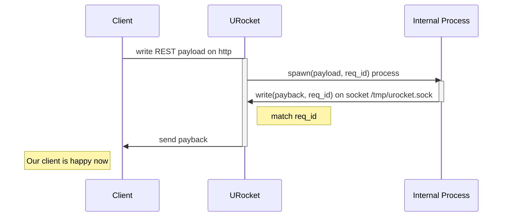

# URocket http stage

It proxy requests from http to an executable which is supposed to write response in a socket.

Splitting the above sentence:
- an http service that: 1. catch REST payload, 2. assign a uuid req_id
- (*not provided*!) an executable that: 1. accept a json payload, 2. write something in a unix socket (a file)
- an http service listening on the unix socket and match the req_id and send back to the caller



This code aims to handle req_id generation and matching, process spawn, timeout, exceptional case, logging, ... whatever is needed to make it stable enough to be used on production.

The name urocket-stage-http. During the launch of a rocket on the space, at some point the rocket
split in 2 parts and the first stage is missed. This happens when the rocket is on the cloud.
I would call this "usefull rocket stage".

Nothing to do with rust rocket, in fact the code use hyper because it needs minimal staff.

Openapi reference:
- https://swagger.io/specification/
- https://editor.swagger.io/

Scripting language are supported by specifying the executable

The openapi is used as it is, without any change, example:

```
paths:
  /pets:
    post:
      tags:
        - pet
      summary: Add a new pet to the store
      description: Add a new pet to the store
      operationId: addPet
      requestBody:
        description: Create a new pet in the store
        content:
          application/json:
            schema:
              $ref: '#/components/schemas/Pet'
          application/xml:
            schema:
              $ref: '#/components/schemas/Pet'
          application/x-www-form-urlencoded:
            schema:
              $ref: '#/components/schemas/Pet'
        required: true
```

The service attach the backend callback using its own configuration file, `urocket-service.yaml`,
that replicate the `paths.uri.method` schema to define each `uri.method` callback infos:

```
paths:
  /get/pets:
    get:
      validatein: false
      inject:
        wd: /src/scripts/php
        env:
          - MYENV=CI
        cmd: /usr/bin/echo
        channel: "cmdline"
        encoding: json
      logstdout: true
      outtake: usocket://uri/{req_id}
      validate-out: false
```

This will execute `/usr/bin/echo` on work dir defined in `wd`, with env ... see below for the
details.

## Using the socket: php example

PHP use the socket for reply, i.e. libcurl:

```php
$ch = curl_init();

// $postdata = json_encode($data); // typically
$postdata = '{"handler": "pricechange", "pricelist": [{"articlenr":"12312", ...}]}';

curl_setopt($ch, CURLOPT_UNIX_SOCKET_PATH, "/tmp/uselessrock.sock");

curl_setopt($ch, CURLOPT_POST, 1);
curl_setopt($ch, CURLOPT_POSTFIELDS, $postdata);
curl_setopt($ch, CURLOPT_RETURNTRANSFER, 1); 
curl_setopt($ch, CURLOPT_HTTPHEADER, array('Content-Type: application/json'));

$result = curl_exec($ch);
curl_close($ch);
print_r ($result);
```


## Testing curl

Is a dummy hostname required?

> curl --unix-socket /var/run/docker.sock http://localhost/images/json

or:

> curl --unix-socket /var/run/docker.sock http:/images/json

see:
https://superuser.com/a/925610

> cURL 7.50 and up requires a valid URL to be provided, including a hostname, so to run the above examples with cURL 7.50, a "dummy" hostname has to be added

## Message in / Message out

A message type is identified by (path, verb), as defined in OpenAPI definition `paths.[path].[verb]`.
There are 4 distinct stage for a message type:

1. incoming: defined as http verb + payload
2. transported-in: defined as process execution env
3. transported-out: defined by ipc channel
4. outgoing: defined as http verb and payload

Stages 1. and 4. can add a layer of validation for payload,
incoming and/or outgoing, the validation is based on Open API definition.

For 2. and 3. : **both are a map between "http-path+verb"**:

```
paths:
  "get/pets":
    get:
      validate-in: false
      inject: {{ process-env }}
      logstdout: true | false
      outtake: usocket://one/the/uuuid-123123-ggess-2123123
      validate-out: false
    post: ...
      in: {{ process-env }}
      out: {{ ipc-channel }}
```

Note on **logstdout**: the service should be able to log stdout of the script.
This can be supported by specifying special header in incoming http request (http header),
or by other means, TBD.

### process-env

The process is started with these env variables settled:

```
URIPATH=/path/in/request/uri
REQUEST_ID={unique request id used to match the result}
```

```
wd: /path/to/wd
env: [string]
cmd: command line
channel: cmdline | stdin | ...
encoding: json
```

If "channel: cmdline" then payload is passed as escaped commandline argument, i.e.:

> [cmd] '{"my": "json", "payload": "et cetera", "et": true, "cetera": false}'

If "channel: stdin" then payload pass through the stdin

### outtake

example:

```
outtake: usocket://uri/{req_id}
```

it is a uri scheme, uscoket means the socketpath defined at top level,
`{req_id}` must be replaced  with the matching request id, ie.:

1. the process read ENV["REQUEST_ID] from environment
2. the process write reply payload in usocket://uri/$ENV["REQUEST_ID]

No others uri scheme are supported, service should refuse to start (if it starts with other schemes then it's a bug)


## TODO

It's a kind of plan.

This project is on POC stage. What is in **already**:

* there is an arbiter that store request_id and dispatch back response via a tokio channel
* frontserv::run_front() listen on port 8080 and use arbiter to store req_id
* backserv::run_backserv() listen on socket file and use arbiter to match and dispatch message to frontserv request waiting on channel.

**TODOs**:

- ~~RequestVisor use Arbiter and replace it in frontserv/backserv~~
- ProcessController match config and RestMessage to create a process
- ProcessController manage timeout (to kill and give back to arbiter)
- ProcessController Timeouts maybe pinned to remove on process exit (??)
- ProcessController should log something.
- Log tracker: select something buffered.
- RequestVisor accept ProcessController
- Add an ErrorXXX struct. Fix all `.unwrap()`s

## Current limits of tokio::process::Command

This https://github.com/tokio-rs/tokio/pull/2907 is very cool

anyway it is not possible to `wait4()` a process to collect resource usage, as in
https://github.com/Sackbuoy/mem_usage :

```rust
use wait4::{ResUse, Wait4};
let process_resources: ResUse;

let _child_process: Child = match cmd.spawn() {
    Ok(mut child) => {
        process_resources = child.wait4()?;
        child
    }
    Err(e) => return Err(Box::new(e)),
};
```

using https://crates.io/crates/wait4

That's really what is needed for stats.

Also it can be desirable to have monitoring staff

This https://docs.rs/tokio-metrics/latest/tokio_metrics/ monitors the internal tasks,
but child spawned are under control of the operating system.

The only way to access this infos is by procps:
https://docs.rs/procfs/latest/procfs/process/struct.Stat.html

For stats: inspect procps before calling wait() in https://doc.rust-lang.org/std/process/struct.Child.html

For monitoring use procps periodically.

## limits by Linux cgroups v2

A more advanced (and maybe simpler) way to limit/control resource of the spawned process
would be by using cgroups ns https://crates.io/crates/cgroups-rs

It would be simpler because the only limit to control from urocket became the timeout
for the process. Other resources would be limited by the os.

The aim of this project is a kind of "it works on my machines", meaning not
working anywhere else but on some targets system, typically are those supported
by Kubernetes, and configured with cgroups v2 (hierarchical)

And simpler is better, but a kind of ProcessDriver should be writed ad hoc, that plugs
well in tokio async.
