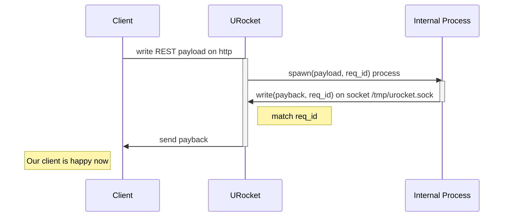

# URocket http stage

urocket-http-stage proxies requests to an executable which will write response in a socket.

Splitting the above sentence:
- the http service (the front service) listen on specified port: 1. catch REST payload, 2. assign a uuid req_id
- (*not provided*!) the executable must: 1. accept a json payload, and the uuid, in environment variables 2. write payload of response in a unix socket
- another http service (the backend service) listening on the unix socket and match the req_id and send back to the caller

Why not just nginx? This example should become a crate, a library that can be used together with other
crate, maybe consuming messages from a message broker, in a number of way.

The plan is to provides a number of way to re-use existing code, but over a stable async green
thread model: so more urocket-xyz-stage(s).



**Quick example**:

1. Open 3 command line shell: `sh-serv`, `sh-front`, `sh-back`
2. in `sh-serv` run `cargo run -- -c examples/urocket-service.yaml`
3. in `sh-front` run `curl  -X POST localhost:8080/get/pets -H'Content-type: application/json'  -d'{"payload":"low"}'` (this shell is blocked)
4. read the message in `sh-serv` shell, something like `I stored the reqid :: 64ed1763-9ca9-4b95-b47f-75c1318b3462`
5. in `sh-back` shell run `curl -X POST --unix-socket /tmp/urocket.sock http://internal/urhttp/something -H'Content-type: application/json' -d'{"hello":true}'` (and still the shell in `sh-front` is blocked)
6. again in `sh-back` shell run `curl -X POST --unix-socket /tmp/urocket.sock http://internal/urhttp/64ed1763-9ca9-4b95-b47f-75c1318b3462 -H'Content-type: application/json' -d'{"hello":true}'`
7. the shell in `sh-front` is unblocked, and it received the message `{"hello":true}`

This code aims to handle req_id generation and matching, process spawn, timeout, exceptional case, logging, ... whatever is needed to make it stable enough to be used on production.

The name urocket-stage-http. During the launch of a rocket on the space, at some point the rocket
split in 2 parts and the first stage is missed. This happens when the rocket is on the cloud.
I would call this "usefull rocket stage".

Nothing to do with rust rocket, in fact the code use hyper since it needs minimal staff.

Openapi reference:
- https://swagger.io/specification/
- https://editor.swagger.io/

Scripting language are supported by specifying the executable

The openapi is used as it is, without any change, example:

```
paths:
  /pets:
    post:
      tags:
        - pet
      summary: Add a new pet to the store
      description: Add a new pet to the store
      operationId: addPet
      requestBody:
        description: Create a new pet in the store
        content:
          application/json:
            schema:
              $ref: '#/components/schemas/Pet'
          application/xml:
            schema:
              $ref: '#/components/schemas/Pet'
          application/x-www-form-urlencoded:
            schema:
              $ref: '#/components/schemas/Pet'
        required: true
```

The service attach the backend callback using its own configuration file, `urocket-service.yaml`,
that replicate the `paths.uri.method` schema to define each `uri.method` callback infos:

```
paths:
  /get/pets:
    get:
      validatein: false
      inject:
        wd: /src/scripts/php
        env:
          - MYENV=CI
        cmd: /usr/bin/echo {{jsonpayload}}
        timeout: 1000
        channel: "cmdline"
        encoding: json
      logstdout: true
      validate-out: false
```

This will execute `/usr/bin/echo` on work dir defined in `wd`, with env ... see below for the
details.

## Using the socket: php example

PHP use the socket for reply, i.e. libcurl:

```php
$reqid = $_ENV["REQUEST_ID"];
$ch = curl_init();

// $postdata = json_encode($data); // typically
$postdata = '{"handler": "pricechange", "pricelist": [{"articlenr":"12312", ...}]}';

curl_setopt($ch, CURLOPT_UNIX_SOCKET_PATH, "/tmp/u_rock.sock");

curl_setopt($ch, CURLOPT_URL, "http://doesnotmatt.er/$reqid");
curl_setopt($ch, CURLOPT_POST, 1);
curl_setopt($ch, CURLOPT_POSTFIELDS, $postdata);
curl_setopt($ch, CURLOPT_RETURNTRANSFER, 1); 
curl_setopt($ch, CURLOPT_HTTPHEADER, array('Content-Type: application/json'));

$result = curl_exec($ch);
curl_close($ch);
print_r ($result);
```

## Why not just nginx? or apache with mod_php?

The intent is to quickly port with minimal changes. Typical use case are those of scripts
launched by a cronjob, without any control, and that may be quickly ported by just ppanding
5/5 lines at the end of the scripts.
Also the plan is to define an automatic answer for "success", and output report.

Why not Apache + mod_php:
- because output is returned to the caller.
- security model of mod_php is generally stricter than a PHP cli script

## Testing curl

Is a dummy hostname required?

> curl --unix-socket /var/run/docker.sock http://localhost/images/json

or:

> curl --unix-socket /var/run/docker.sock http:/images/json

see:
https://superuser.com/a/925610

> cURL 7.50 and up requires a valid URL to be provided, including a hostname, so to run the above examples with cURL 7.50, a "dummy" hostname has to be added

## Message in / Message out

A message type is identified by (path, verb), as defined in OpenAPI definition `paths.[path].[verb]`.
There are 4 distinct stage for a message type:

1. incoming: defined as http verb + payload
2. transported-in: defined as process execution env
3. transported-out: defined by ipc channel
4. outgoing: defined as http verb and payload

Stages 1. and 4. can add a layer of validation for payload,
incoming and/or outgoing, the validation is based on Open API definition.

For 2. and 3. : **both are a map between "http-path+verb"**:

```
paths:
  "get/pets":
    get:
      validate-in: false
      inject: {{ process-env }}
      logstdout: true | false
      validate-out: false
    post: ...
      in: {{ process-env }}
      out: {{ ipc-channel }}
```

Note on **logstdout**: the service should be able to log stdout of the script.
This can be supported by specifying special header in incoming http request (http header),
or by other means, TBD.

### process-env

The process is started with these env variables settled:

```
URIPATH=/path/in/request/uri
REQUEST_ID={unique request id used to match the result}
```

```
wd: /path/to/wd
env: [string]
cmd: command_line {{jsonpayload}} otherparam
channel: cmdline | stdin | ...
encoding: json
```

If "channel: cmdline" then payload is passed as escaped commandline argument, i.e.:

> [cmd] '{"my": "json", "payload": "et cetera", "et": true, "cetera": false}'

If "channel: stdin" then payload pass through the stdin

### The backserv socket (was outtake)

The socket filepath is defined in the configuration file

Say we call the (optional) domain `internal` then options for curl is:

--unix-socket /tmp/urocket.sock http://internal/urhttp/{req_id}

`{req_id}` must be replaced  with the matching request id, ie.:

1. the process read `ENV["REQUEST_ID"]` from environment
2. the process write reply payload in `http://internal/urhttp/$ENV["REQUEST_ID]`

This is a fixed uri matched.

Note: backserv just remove `/urhttp/` and take the rest as req_id. (see todo)


## TODO

The service works but it is too rigid. Code can not be splitted and reused in a
productive way. For example processcontroller by itself can be a staff to be reused.
And so for other parts.

`frontserv` and `backserv` are the most service-specific staff.

toktor crate should be splitted and moved as indipendent, once it is more idiomatic.

**TODOs**:

- ~~RequestVisor use Arbiter and replace it in frontserv/backserv~~
- ~~ProcessController match config and RestMessage to create a process~~
- ~~ProcessController manage timeout (to kill and give back to arbiter)~~
- ~~ProcessController Timeouts maybe pinned to remove on process exit (??)~~
- ProcessController should log something.
- Log tracker: select something buffered.
- ~~RequestVisor accept ProcessController~~
- Add an ErrorXXX struct. Fix all `.unwrap()`s

## Use `std::process::Command` not `tokio::process::Command`

Instead of tokio, `std::process::Command` is used, this make possible to handle specific process information, and avoid zombie (it does not need tini, rif, https://github.com/krallin/tini)

Also `wait4()` is called on each process (using https://crates.io/crates/wait4).

ResUse is stored in ProcessInfos, at least for 2 seconds after the end of the process,
together with StdOut and StdErr. If requested it is returned over a mpsc channel,
as Option<ProcessInfos> (if requested too late it is just None).

Also it can be desirable to have monitoring staff

This https://docs.rs/tokio-metrics/latest/tokio_metrics/ monitors the internal tasks,
but child spawned are under control of the operating system.

The only way to access this infos is by procps:
https://docs.rs/procfs/latest/procfs/process/struct.Stat.html

For stats: inspect procps before calling wait() in https://doc.rust-lang.org/std/process/struct.Child.html

For monitoring use procps periodically.

## Plan for stats

Stats is still not implemented. ResUse is collected but requestvisor is not
asking for stats.

This should be controlled by configuration file:

```
paths:
  /get/pets:
    get:
      validatein: false
      inject:
        wd: /src/scripts/php
        env:
          - MYENV=CI
        cmd: /usr/bin/echo {{jsonpayload}}
        timeout: 1000
        channel: "cmdline"
        encoding: json
      ## this would add http header urocket-stats: {time: 1.2, mem: 123123, ...}
      stats: true
      logstdout: true
      validate-out: false
```

When is `stats: true` the response header should contains something like:

```
urocket-stats: ResourceUsage { utime: 1.886ms, stime: 0ns, maxrss: 5505024 }
```

Some more info should be collected, maybe stdout len, stderr len, start time, and so on.

One can think about stats write in file, or stat printout also.

## limits by Linux cgroups v2

A more advanced (and maybe simpler) way to limit/control resource of the spawned process
would be by using cgroups ns https://crates.io/crates/cgroups-rs

It would be simpler because the only limit to control from urocket became the timeout
for the process. Other resources would be limited by the os.

The aim of this project is a kind of "it works on my machines", meaning not
working anywhere else but on some targets system, typically are those supported
by Kubernetes, and configured with cgroups v2 (hierarchical)

And simpler is better, but a kind of ProcessDriver should be writed ad hoc, that plugs
well in tokio async.

https://docs.rs/cgroups-rs/0.3.4/cgroups_rs/cgroup_builder/index.html

Looking at this, the options provided by cgroups_rs is:

1. create the control group
2. create the `Child` process
3. insert the created `Child` into the created controlgroup

Anyway this sequence should be quick enough.

Another option is to use https://docs.rs/controlgroup/latest/controlgroup/ that look less
maintained, or implement trait that extends `std::process::Command`, but I do not think it changes too much.

Also things get complicated with hierarchical cgroups and the option to insert
the process::id() into a main cgroups, then create cgroups based on a kind policy
